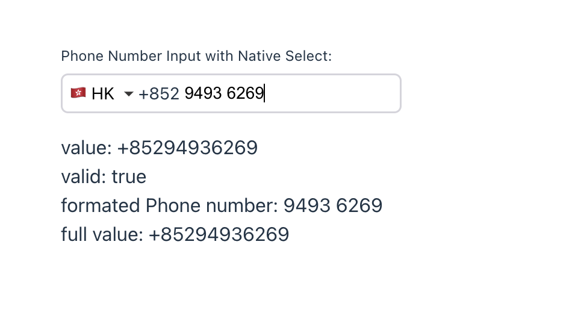

## react-phonenumber-text-input

<b>an international phone number input component for React.</b>



### [online demo](https://codesandbox.io/s/agitated-hill-trvmxc?file=/src/App.tsx)

### Install

```bash
  npm install react-phonenumber-text-input --save
```

```bash
  yarn add react-phonenumber-text-input
```

```bash
  pnpm add react-phonenumber-text-input
```

#### Features

1. **support comlpletely custom style**
   - you can use `className` `style` `inputClassName` `inputStyle` `selectClassName` `selectStyle` `optionClassName` `optionStyle` to custom all the style what you want
   - you can use `SelectComponent` `CallingCodeComponent` `InputComponent` `WrapperComponent` to custom the select, calling code, input and wrapper component
2. **so easy to use**
   - import the component and use it simply, no need to worry about the country code, the phone number format, the validation, etc. the component will handle all the things for you
3. **auto parse and format the phone number**
   - when you input phone number with `+`, the component will recognize the country code and format the phone number automatically
   - the component will auto format the phone number when you input the phone number

#### Usage

1. basic usage

   ```tsx
   import './App.css'
   import { useState } from 'react'
   import AntSelect from './components/AntSelect'
   import CallingCode from './components/CallingCode'
   import AntInput from './components/AntInput'
   import PhoneNumberInputWrapper from './components/PhoneNumberSelectWrapper'
   import PhonenumberInput, {
     BaseReactPhonenumberInput,
     PhoneNumberInputWithNativeSelect,
   } from 'react-phonenumber-text-input'

   function App() {
     const [value, setValue] = useState('')
     const [valid, setValid] = useState(false)
     const [formatedPhonenumber, setFormatedPhonenumber] = useState('')
     const [fullValue, setFullValue] = useState('')
     const [value2, setValue2] = useState('')
     const [valid2, setValid2] = useState(false)
     const [formatedPhonenumber2, setFormatedPhonenumber2] = useState('')
     const [fullValue2, setFullValue2] = useState('')

     const [value3, setValue3] = useState('')
     const [valid3, setValid3] = useState(false)
     const [formatedPhonenumber3, setFormatedPhonenumber3] = useState('')
     const [fullValue3, setFullValue3] = useState('')

     return (
       <div
         className="App"
         style={{
           margin: '100px',
           textAlign: 'left',
         }}
       >
         <div>
           <label
             style={{
               lineHeight: '30px',
               fontSize: '12px',
             }}
           >
             <span>Phone Number Input with Native Select:</span>
           </label>
           <PhoneNumberInputWithNativeSelect
             value={value}
             onChange={(v, metadata) => {
               setValue(v)
               setValid(metadata.valid)
               setFormatedPhonenumber(metadata.formated)
               setFullValue(metadata.fullValue)
             }}
             style={{
               width: '200px',
             }}
           />
           <p>
             value: {value} <br />
             valid: {valid ? 'true' : 'false'} <br />
             formated Phone number: {formatedPhonenumber} <br />
             full value: {fullValue} <br />
           </p>
         </div>

       <div
       <div
         className="App"
         <div
         className="App"
           style={{
             height: '60px',
           }}
         ></div>
         <div>
           <label
             style={{
               lineHeight: '30px',
               fontSize: '12px',
             }}
           >
             <span>Phone Number Input:</span>
           </label>
           <PhonenumberInput
             value={value2}
             onChange={(v, metadata) => {
               setValue2(v)
               setValid2(metadata.valid)
               setFormatedPhonenumber2(metadata.formated)
               setFullValue2(metadata.fullValue)
             }}
             style={{
               width: '200px',
             }}
           />
           <p>
             value: {value2} <br />
             valid: {valid2 ? 'true' : 'false'} <br />
             formated Phone number: {formatedPhonenumber2} <br />
             full value: {fullValue2} <br />
           </p>
         </div>

         <div>
           <label
             style={{
               lineHeight: '30px',
               fontSize: '12px',
             }}
           >
             <span>Custom Phone Number Input by use ant desgin:</span>
           </label>
           <BaseReactPhonenumberInput
             value={value3}
             onChange={(v, metadata) => {
               setValue3(v)
               setValid3(metadata.valid)
               setFormatedPhonenumber3(metadata.formated)
               setFullValue3(metadata.fullValue)
             }}
             style={{
               width: '200px',
             }}
             SelectComponent={AntSelect}
             CallingCodeComponent={CallingCode}
             InputComponent={AntInput}
             WrapperComponent={PhoneNumberInputWrapper}
           />
           <p>
             value: {value3} <br />
             valid: {valid3 ? 'true' : 'false'} <br />
             formated Phone number: {formatedPhonenumber3} <br />
             full value: {fullValue3} <br />
           </p>
         </div>
       </div>
     )
   }

   export default App
   ```

2. props of PhonenumberInput

   | name                | type                                                                                       | default                          | description                                                                                                                                                                                                                                           |
   | ------------------- | ------------------------------------------------------------------------------------------ | -------------------------------- | ----------------------------------------------------------------------------------------------------------------------------------------------------------------------------------------------------------------------------------------------------- |
   | value               | string                                                                                     | ''                               | the value of the input                                                                                                                                                                                                                                |
   | onChange            | (value: string, metadata: { formated: string; fullValue: string; valid: boolean }) => void | -                                | callback function when the value of the input changes. `value` is value of the input, `formated` is the formated phone number, `fullValue` is the value with country calling code(e.g. +8618902462356), `valid` is the validation result of the input |
   | countries           | CountryCode[]                                                                              | all Countries codes              | the countries to be displayed in the country code selection dropdown                                                                                                                                                                                  |
   | defaultCountry      | CountryCode                                                                                | first country of props.countries | the default country code                                                                                                                                                                                                                              |
   | placeholder         | string                                                                                     | ''                               | the placeholder of the input                                                                                                                                                                                                                          |
   | showCallingCode     | boolean                                                                                    | true                             | whether to show the country calling code in the input                                                                                                                                                                                                 |
   | onCountryCodeChange | (countryCode: CountryCode) => void                                                         | -                                | callback function when the country code changes                                                                                                                                                                                                       |
   | className           | string                                                                                     | undfined                         | the className of the phone number input container                                                                                                                                                                                                     |
   | style               | React.CSSProperties                                                                        | undfined                         | the style of the phone number input container                                                                                                                                                                                                         |
   | inputClassName      | string                                                                                     | undfined                         | the className of the input                                                                                                                                                                                                                            |
   | inputStyle          | React.CSSProperties                                                                        | undfined                         | the style of the input                                                                                                                                                                                                                                |
   | selectClassName     | string                                                                                     | undfined                         | the className of the country code selection dropdown                                                                                                                                                                                                  |
   | selectStyle         | React.CSSProperties                                                                        | undfined                         | the style of the country code selection dropdown                                                                                                                                                                                                      |
   | optionClassName     | string                                                                                     | undfined                         | the className of the country code selection dropdown option (invalid for PhoneNumberInputWithNativeSelect)                                                                                                                                            |
   | optionStyle         | React.CSSProperties                                                                        | undfined                         | the style of the country code selection dropdown option (invalid for PhoneNumberInputWithNativeSelect)                                                                                                                                                |

3. custom style

   - basic
     - use `className` and `style` props to custom the style of the phone number input container
     - use `inputClassName` and `inputStyle` props to custom the style of the input
     - use `selectClassName` and `selectStyle` props to custom the style of the country code selection dropdown
     - use `optionClassName` and `optionStyle` props to custom the style of the country code selection dropdown option (invalid for PhoneNumberInputWithNativeSelect)
   - advanced
     use BaseReactPhonenumberInput (see detail on [online demo](https://codesandbox.io/s/agitated-hill-trvmxc?file=/src/App.tsx))
     BaseReactPhonenumberInput has four extra props:
     - `SelectComponent`
     - `CallingCodeComponent`
     - `InputComponent`
     - `WrapperComponent`
